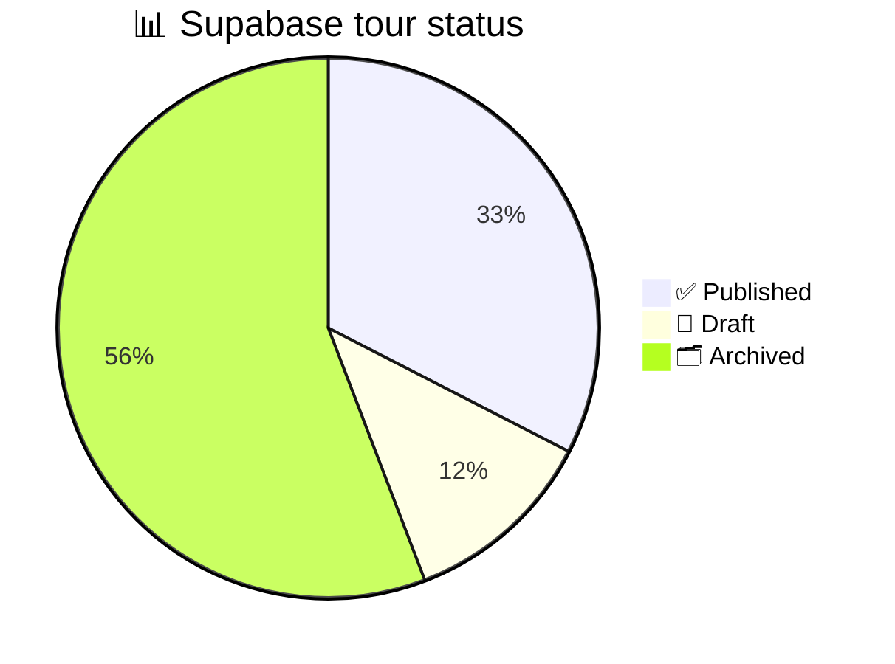

# Gia Lai Eco Tourist — tour EDA report

_Live Supabase snapshot on 2026-09-21 · Scope: `published` and `archived` tours_

---

## 📋 Executive summary

- Supabase currently contains **43 tour rows**: 14 `published`, 5 `draft`, and 24 `archived`.
- This report covers **38 tours** in the requested cohorts and excludes the 5 drafts.
- The 14 published tours are source-mapped, have complete day-by-day itineraries, and have at least one published price option. They are concentrated entirely in Tây Nguyên.
- The 24 archived tours are legacy illustrative/seed records. None has destinations, an itinerary, a source-document mapping, or a published price.
- The most important published-data risks are the absence of approved source documents, missing cancellation policies on half of the public catalogue, missing price-validity windows, and the lack of media assets.

> ⚠️ **Interpretation:** The database has 43 rows, but the source-grounded public catalogue is currently the 14-tour published cohort. The 24 archived rows should not be treated as ready-to-publish products.

## 📊 Scope and method

### Data sources

The analysis joins the live Supabase tables below:

| Table | Role in the analysis |
| --- | --- |
| `public.tours` | Parent tour records and status |
| `public.tour_itinerary_days` | Ordered itinerary completeness |
| `public.tour_price_options` | Published, draft, and card-price options |
| `public.tour_media` | Tour-to-media relationships |
| `public.media_assets` | Available media inventory |
| `content_private.source_documents` | Source-file review state |
| `content_private.source_document_tours` | Source-to-tour provenance mapping |

### Definitions

- **Published tour:** parent row with `public.tours.status = 'published'`.
- **Archived tour:** parent row with `public.tours.status = 'archived'`.
- **Complete itinerary:** the tour has itinerary rows covering at least `duration_days`.
- **Published price:** a child row in `tour_price_options` with `status = 'published'`.
- **Source-backed:** the tour has at least one row in `source_document_tours`; this does not mean the document has been approved.

### Snapshot limitations

- Statistics are a point-in-time read of the live database on 2026-09-21.
- No data was changed while producing this report.
- Prices without a numeric amount are treated as contact-only pricing, not as zero-priced tours.
- Archived prices are reported for data-quality inspection only; they are explicitly unverified seed values.

## ✅ Published tour analysis

### Catalogue shape

| Metric | Result | Interpretation |
| --- | ---: | --- |
| Total published tours | **14** | Current public catalogue |
| Region | **14/14 Tây Nguyên** | Strong geographic concentration |
| Theme | **11 văn hóa, 3 thiên nhiên** | Culture-heavy catalogue |
| Duration | **9×3N2Đ, 4×4N3Đ, 1×5N4Đ** | Mid-length group tours dominate |
| Destinations per tour | **4.71 average** | Range: 3–7 destinations |
| Itinerary rows | **48** | All 14 tours cover their declared duration |
| Featured tours | **8/14** | 57.1% marked featured |
| Card price field | **13/14** | One tour is contact-only |

### Content completeness

| Field or relationship | Published | Notes |
| --- | ---: | --- |
| Summary | 14/14 | Complete |
| Destinations | 14/14 | Complete |
| Theme | 14/14 | Complete |
| Itinerary | 14/14 | 48 ordered day rows |
| Itinerary matches duration | 14/14 | No day-count mismatch |
| Published price option | 14/14 | Every public tour has a price row |
| Highlights | 14/14 | Complete |
| Inclusions / exclusions | 14/14 | Complete |
| Accommodation / transport notes | 14/14 | Complete |
| Child / surcharge policies | 14/14 | Complete |
| Cancellation policy | 7/14 | Missing on 7 tours |
| Source mapping | 14/14 | 23 document mappings |
| Approved source mapping | 0/14 | All 23 mapped documents are `in_review` |
| Media relationship | 0/14 | No `tour_media` rows |
| Numeric difficulty / group max | 0/14 | Intentionally left blank by the editorial rules |
| Impact statement | 0/14 | Intentionally left blank by the editorial rules |

### Price analysis

The published cohort has **16 price-option rows** across 14 tours:

- 15 rows have `status = 'published'`.
- 14 published rows are marked as card prices.
- One additional row is a draft, non-card quotation of **5.300.000đ** for a group of five on the Pleiku–Kon Tum–Măng Đen–Buôn Ma Thuột 4N3Đ tour.
- The Buôn Ma Thuột–Buôn Đôn–Dray Nur–Hồ Lắk 4N3Đ tour has a published contact-only option with `amount_vnd = NULL`.
- All published price rows have no `valid_from` or `valid_until`, so there is no database-level price-expiry mechanism yet.
- The 15 published price rows have `verified_at` values, but this field does not replace source-document approval; the source documents remain `in_review`.

For the 13 tours with a numeric `starting_price_vnd`, the average is **4.123.462đ**, the median is **4.245.000đ**, and the range is **2.445.000–7.315.000đ**.

### Provenance and merchandising

The 14 published tours are linked to **23 distinct source documents**: 13 primary mappings, 5 revision mappings, and 5 supporting mappings. This is good provenance coverage, but the review workflow is incomplete because none of the 23 documents is marked `approved`.

The media inventory is empty: `public.media_assets` and `public.tour_media` currently contain no rows. The frontend therefore relies on fallback/local images rather than tour-specific Supabase media.

### Published tour inventory

| Tour | Theme | Duration | Card price | Source docs |
| --- | --- | ---: | ---: | ---: |
| Pleiku – Kon Tum – Măng Đen | Văn hóa | 3N2Đ | 3.590.000đ | 1 |
| Pleiku – Kon Tum – Măng Đen – Buôn Ma Thuột | Văn hóa | 4N3Đ | 4.845.000đ | 3 |
| Pleiku – Kon Tum – Măng Đen · Tour ghép Tây Nguyên 2026 | Văn hóa | 3N2Đ | 4.345.000đ | 1 |
| Pleiku – Kon Tum – Măng Đen: Chư Đăng Ya | Thiên nhiên | 3N2Đ | 2.845.000đ | 1 |
| Hà Nội – Pleiku – Măng Đen – Cột mốc 3 biên | Văn hóa | 3N2Đ | 3.145.000đ | 6 |
| Pleiku – Măng Đen – Kon Tum – Buôn Ma Thuột | Văn hóa | 5N4Đ | 7.315.000đ | 1 |
| Buôn Ma Thuột – Buôn Đôn – Dray Nur – Hồ Lắk | Thiên nhiên | 4N3Đ | Liên hệ | 1 |
| Hải Phòng – Buôn Ma Thuột | Văn hóa | 3N2Đ | 3.345.000đ | 1 |
| Buôn Ma Thuột – Buôn Đôn – Núi Đá Voi – Hồ Lắk | Văn hóa | 3N2Đ | 3.445.000đ | 1 |
| Hải Phòng – Buôn Ma Thuột – Pleiku – Măng Đen | Văn hóa | 4N3Đ | 4.850.000đ | 1 |
| Hà Nội/TP.HCM – Buôn Ma Thuột – Pleiku – Măng Đen | Văn hóa | 4N3Đ | 4.845.000đ | 2 |
| Vinh – Buôn Ma Thuột – Buôn Đôn – Hồ Lắk | Văn hóa | 3N2Đ | 4.345.000đ | 1 |
| Huế – Măng Đen – Kon Tum – Pleiku | Văn hóa | 3N2Đ | 2.445.000đ | 1 |
| Hà Nội – Pleiku – Măng Đen – Buôn Ma Thuột | Thiên nhiên | 3N2Đ | 4.245.000đ | 2 |

## 🗂️ Archived tour analysis

### Catalogue shape

| Metric | Result | Interpretation |
| --- | ---: | --- |
| Total archived tours | **24** | Legacy cohort |
| Region coverage | **8 regions × 3 tours** | Artificially even seed distribution |
| Duration | **4×1 ngày, 9×2N1Đ, 8×3N2Đ, 3×4N3Đ** | Broad demo mix |
| Difficulty | **10 dễ, 10 vừa, 4 khó** | Seed attributes, not source-verified |
| Average duration | **2.42 ngày / 1.42 đêm** | Shorter than published tours |
| Card-price field | **24/24** | Values are illustrative and unverified |

### Content completeness

| Field or relationship | Archived | Notes |
| --- | ---: | --- |
| Summary | 24/24 | Present in seed rows |
| Theme | 24/24 | Present in seed rows |
| Highlights | 24/24 | Present in seed rows |
| Destinations | 0/24 | Missing |
| Itinerary | 0/24 | Missing |
| Itinerary covers duration | 0/24 | Not applicable because itinerary is absent |
| Published price option | 0/24 | None is publishable |
| Source mapping | 0/24 | No local source document linked |
| Inclusions / exclusions | 0/24 | Missing |
| Accommodation / transport notes | 0/24 | Missing |
| Customer policies | 0/24 | Missing |
| Media relationship | 0/24 | Missing |

Every archived tour has one child price option, but all 24 child options are `draft`, have no validity dates, have no verification timestamp, and use an unverified illustrative-price condition. They should not be used as commercial pricing.

### Archived tour inventory

| Region | Tour | Theme | Duration | Seed price |
| --- | --- | --- | ---: | ---: |
| Tây Bắc | Mù Cang Chải mùa lúa chín | Trekking | 3N2Đ | 3.180.000đ |
| Tây Bắc | Chợ phiên Bắc Hà và bản Tả Van | Văn hóa | 2N1Đ | 1.930.000đ |
| Tây Bắc | Fansipan theo đường Trạm Tôn | Phiêu lưu | 4N3Đ | 4.750.000đ |
| Đông Bắc | Cao nguyên đá Đồng Văn và Mã Pí Lèng | Phiêu lưu | 4N3Đ | 4.280.000đ |
| Đông Bắc | Hồ Ba Bể trên thuyền độc mộc | Thiên nhiên | 2N1Đ | 1.680.000đ |
| Đông Bắc | Thác Bản Giốc và động Ngườm Ngao | Thiên nhiên | 3N2Đ | 2.740.000đ |
| Bắc Bộ | Vịnh Lan Hạ và làng chài Việt Hải | Biển đảo | 2N1Đ | 2.260.000đ |
| Bắc Bộ | Tràng An, Tam Cốc và rừng Cúc Phương | Thiên nhiên | 3N2Đ | 2.580.000đ |
| Bắc Bộ | Gốm Bát Tràng và lụa Vạn Phúc | Văn hóa | 1 ngày | 690.000đ |
| Bắc Trung Bộ | Hang Én giữa Phong Nha Kẻ Bàng | Phiêu lưu | 3N2Đ | 6.150.000đ |
| Bắc Trung Bộ | Huế: lăng tẩm và một buổi chiều sông Hương | Văn hóa | 2N1Đ | 1.760.000đ |
| Bắc Trung Bộ | Pù Luông và những guồng nước | Trekking | 3N2Đ | 2.470.000đ |
| Nam Trung Bộ | Hội An và bếp làng rau Trà Quế | Ẩm thực | 2N1Đ | 1.540.000đ |
| Nam Trung Bộ | Cù Lao Chàm và rạn san hô | Biển đảo | 1 ngày | 940.000đ |
| Nam Trung Bộ | Bàu Trắng và đồi cát Mũi Né | Phiêu lưu | 2N1Đ | 1.620.000đ |
| Tây Nguyên | Qua tầng rừng Kon Ka Kinh | Trekking | 3N2Đ | 2.400.000đ |
| Tây Nguyên | Một đêm ở làng Bahnar | Văn hóa | 2N1Đ | 1.850.000đ |
| Tây Nguyên | Thác K50 giữa Kon Chư Răng | Phiêu lưu | 4N3Đ | 3.600.000đ |
| Đông Nam Bộ | Rừng ngập mặn Cần Giờ | Thiên nhiên | 1 ngày | 780.000đ |
| Đông Nam Bộ | Côn Đảo: mùa rùa lên bãi | Biển đảo | 3N2Đ | 5.420.000đ |
| Đông Nam Bộ | Núi Bà Đen và hồ Dầu Tiếng | Trekking | 2N1Đ | 1.390.000đ |
| Đồng bằng sông Cửu Long | Chợ nổi Cái Răng và cù lao Tân Lộc | Ẩm thực | 2N1Đ | 1.470.000đ |
| Đồng bằng sông Cửu Long | Rừng tràm Trà Sư mùa nước nổi | Thiên nhiên | 1 ngày | 850.000đ |
| Đồng bằng sông Cửu Long | Đất Mũi Cà Mau và rừng U Minh Hạ | Phiêu lưu | 3N2Đ | 2.980.000đ |

## ⚠️ Data-quality findings

| Priority | Finding | Evidence | Recommended handling |
| --- | --- | --- | --- |
| P0 | Contact-only published price | 1 published tour has `amount_vnd = NULL` | Render an explicit “Liên hệ” state or add a confirmed amount |
| P0 | Source approval incomplete | 23/23 published source mappings are `in_review` | Review and approve source files before treating provenance as final |
| P1 | No price validity windows | 15 published price rows have no validity dates | Add validity dates or a controlled revalidation workflow |
| P1 | Missing cancellation policies | 7/14 published tours have no cancellation policy | Complete policy copy before scaling paid traffic |
| P1 | No tour media in Supabase | 0 rows in `media_assets` and `tour_media` | Attach cover/gallery assets or explicitly document fallback behavior |
| P2 | Archived child prices remain draft | 24 archived tours each retain one draft price option | Keep non-public, but align child status or document the intentional state |
| P2 | Archived records are not source-grounded | 0/24 have source mappings or itineraries | Treat them as backlog/seed data; do not bulk-publish |

## ✏️ Recommended next actions

1. Keep the 24 archived rows archived; changing only the parent status would expose incomplete and unverified content.
2. Resolve the contact-only price behavior for the Buôn Ma Thuột 4N3Đ tour and test the card/detail-page rendering.
3. Complete source review for the 23 documents linked to published tours.
4. Add cancellation-policy copy to the 7 affected published tours.
5. Introduce price validity or a mandatory `last_reviewed_at`/revalidation process for every published option.
6. Add source-grounded cover and gallery media before using the catalogue for SEO or paid acquisition.
7. Only promote an archived tour after adding a source mapping, route/destinations, day-by-day itinerary, verified pricing, policies, and media.

## 🔗 References

- [Source-grounded catalogue ledger](./tour-pilot.md) — editorial decisions and local-source import notes
- Live Supabase tables: `public.tours`, `public.tour_itinerary_days`, `public.tour_price_options`, `public.tour_media`, `public.media_assets`, `content_private.source_documents`, and `content_private.source_document_tours`

_Report generated from a read-only live Supabase snapshot. No database mutation was performed._
