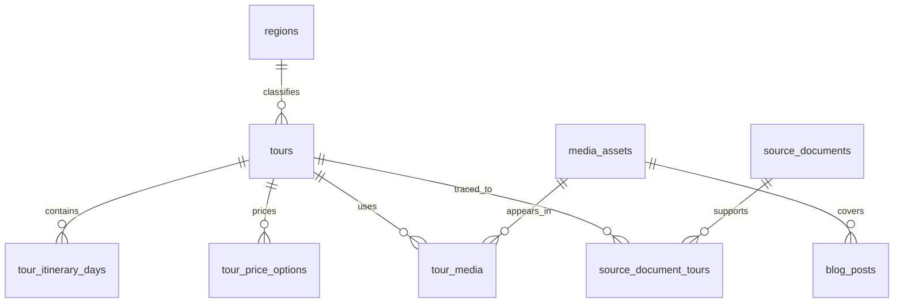

# Database Schema Specification: Supabase Content

**Feature Branch**: `002-supabase-content`  
**Created**: 2026-09-16  
**Status**: Implemented in Supabase; editorial review pending  
**Input**: “Define the Supabase database for the Gia Lai Eco Tourist website.”

## Purpose

Define the smallest useful Supabase schema for the existing Gia Lai Eco Tourist frontend and the agency’s brochure archive.

The schema stores approved public tour pages, their ordered itineraries and conditional prices, blog posts, regions, and media. It also keeps a private record of source documents so public content can be traced back to an agency file.

This is a content catalogue. It is not a booking, payment, availability, accounting, or customer-management schema.

## Source and frontend facts

The current app has:

- 24 illustrative tour records in `src/data/tours.ts`.
- A separate four-item homepage experience list in `src/pages/HomePage.tsx`.
- Filters for region, theme, duration, price, difficulty, season, and group size.
- A photo gallery called “Journal,” but no blog-post model or article route.
- No current database connection.
- A contact form that currently shows success locally but does not save an enquiry.

The archive has approximately 26 `.doc` files, one `.docx`, three PDFs, and one unrelated Pages file. Most files describe three-day/two-night or four-day/three-night journeys. They contain weekly schedules, exact dates, vague year/month labels, blank prices, group-specific prices, and revisions with changed hotels or meals.

## Initial Supabase load

The first load is now applied to project `GL_Eco_DB` (`uxeuskwcgzytwlbahlfm`):

- Eight region rows.
- Twenty-four draft tour rows copied from the existing illustrative frontend catalogue, plus one remaining draft candidate from the archive pilot; two source-grounded candidates are published for the first web demo.
- Twenty-eight price options: twenty-four unverified frontend sample prices, two group-tier prices from a 4-day brochure, one 3-day brochure price, and one blank-price option. Two approved card prices are published for the demo; the rest remain drafts.
- Ten draft itinerary-day rows for the three source-grounded pilot candidates.
- Thirty private source-document metadata rows with SHA-256 hashes. The original files still need to be uploaded to the private Storage bucket before review.
- Three source-document links connect the pilot candidates to their originating files.
- Two published tours, with their published card prices and itinerary days, are available for the first demo. Media assets and blog posts remain empty.

The draft tours preserve the current card content for migration review. Their prices, capacity values, departure months, difficulty, and impact text must be confirmed against the source archive before any row is published.

A source file is not automatically a public tour. One database row represents one approved public catalogue page. Historical revisions and customer-specific quotations remain source records unless the agency explicitly sells them as separate public offerings.

## Data model

The schema is split into:

- **Public content** in the exposed `public` schema.
- **Private provenance** in a non-exposed `content_private` schema.
- **Files** in Supabase Storage, with metadata in `media_assets`.

## Public tables

### `regions`

The existing eight Explore regions. A region may have zero published tours; the system must not invent tours to fill a region.

| Column | Type | Rules |
|---|---|---|
| `slug` | text | Primary key; lowercase URL value |
| `name` | text | Required Vietnamese display name |
| `characterisation` | text | Optional supporting sentence |
| `sort_order` | integer | Required, default 0 |
| `cover_media_id` | uuid | Optional reference to `media_assets.id` |
| `status` | text | `published` or `archived`; default `published` |
| `created_at`, `updated_at` | timestamptz | Required |

Seed the eight current region labels, but only assign a tour to a region when its itinerary supports that classification.

### `tours`

One row is one approved public tour page. This is the table the homepage and Explore page read.

| Column | Type | Rules and meaning |
|---|---|---|
| `id` | uuid | Primary key, generated by Supabase |
| `slug` | text | Required and unique |
| `title` | text | Required public title |
| `summary` | text | Required card description |
| `category` | text | `domestic` or `international`; default `domestic` |
| `region_slug` | text | Required foreign key to `regions.slug` |
| `destinations` | text[] | Named places in the route |
| `theme` | text | Optional reviewed value used by the theme filter |
| `duration_days` | smallint | Required, greater than 0 |
| `duration_nights` | smallint | Required, 0 or greater |
| `starting_price_vnd` | bigint | Nullable approved card price per traveller |
| `departure_text` | text | Original reviewed wording, such as “Thứ 6 hàng tuần” |
| `departure_months` | smallint[] | Optional months 1–12; never inferred from a bare year |
| `difficulty` | text | Optional reviewed value: `de`, `vua`, or `kho` |
| `group_max` | smallint | Nullable real capacity only |
| `group_label` | text | Optional wording such as “Đoàn 10–12 khách” |
| `highlights` | text[] | Ordered short highlights |
| `impact` | text | Optional agency-approved claim |
| `inclusions` | text[] | Ordered included services |
| `exclusions` | text[] | Ordered excluded services |
| `accommodation_notes` | text | Hotels, room sharing, and equivalents |
| `transport_notes` | text | Vehicle and flight notes |
| `child_policy` | text | Original reviewed child-pricing wording |
| `surcharge_policy` | text | Single-room, holiday, VAT, or other supplements |
| `cancellation_policy` | text | Cancellation wording, if supplied |
| `featured` | boolean | Default false; controls homepage placement |
| `sort_order` | integer | Default 0; curated ordering |
| `status` | text | `draft`, `published`, or `archived` |
| `published_at` | timestamptz | Required when status is `published` |
| `last_reviewed_at` | timestamptz | Required before publication |
| `created_at`, `updated_at` | timestamptz | Required |

The UI derives `durationLabel` from the two duration columns. It maps `summary` to `blurb`, `starting_price_vnd` to `priceVnd`, `region_slug` to `regionSlug`, and the cover relationship to `image`.

`group_max` is intentionally separate from pricing conditions. “Price applies to 10–12 guests” does not prove that 12 is the tour’s maximum capacity. Leave `group_max` null unless the agency confirms a capacity.

`starting_price_vnd` is nullable. A null value means contact pricing. It must never be stored as zero. The editorial process must keep it consistent with the approved card price option in `tour_price_options`.

### `tour_itinerary_days`

Repeating daily itinerary content belongs in rows so it can be ordered, edited, and rendered without parsing a brochure-sized text blob.

| Column | Type | Rules |
|---|---|---|
| `id` | uuid | Primary key |
| `tour_id` | uuid | Required foreign key to `tours.id`, cascade on delete |
| `day_number` | smallint | Required, greater than 0 |
| `title` | text | Required daily route/title |
| `body_md` | text | Required reviewed itinerary text |
| `meals` | text[] | Optional values such as `sáng`, `trưa`, `tối` |
| `overnight_location` | text | Optional overnight location |
| `accommodation_notes` | text | Optional daily accommodation detail |
| `sort_order` | integer | Default 0 |
| `created_at`, `updated_at` | timestamptz | Required |

Add a unique constraint on `(tour_id, day_number)`.

### `tour_price_options`

A tour may have several quoted prices. This table keeps group size and validity conditions attached to the amount.

| Column | Type | Rules and meaning |
|---|---|---|
| `id` | uuid | Primary key |
| `tour_id` | uuid | Required foreign key to `tours.id`, cascade on delete |
| `amount_vnd` | bigint | Nullable; null means contact pricing |
| `currency` | char(3) | Default `VND` |
| `price_basis` | text | `per_person` or `per_group` |
| `min_guests` | smallint | Optional, greater than 0 |
| `max_guests` | smallint | Optional, greater than 0 |
| `valid_from`, `valid_until` | date | Optional explicit validity dates |
| `condition_text` | text | Required human-readable qualification |
| `is_card_price` | boolean | Exactly one approved card price at most |
| `status` | text | `draft`, `published`, or `archived` |
| `verified_at` | timestamptz | Required before public display |
| `sort_order` | integer | Default 0 |
| `created_at`, `updated_at` | timestamptz | Required |

Constraints:

- `amount_vnd` is null or nonnegative.
- `min_guests` is null or less than/equal to `max_guests`.
- `valid_from` is null or less than/equal to `valid_until`.
- A null amount requires a nonempty `condition_text`.
- At most one published option per tour may have `is_card_price = true`.

A quoted price for 10–12 guests is stored here. It is not copied into `tours.group_max`.

### `media_assets`

Metadata for files stored in Supabase Storage.

| Column | Type | Rules |
|---|---|---|
| `id` | uuid | Primary key |
| `bucket` | text | `public-media` or `source-originals` |
| `object_path` | text | Required and unique within bucket |
| `kind` | text | `image`, `brochure`, or `source_document` |
| `alt_text` | text | Required for public images |
| `caption` | text | Optional |
| `mime_type` | text | Required |
| `size_bytes` | bigint | Optional |
| `width`, `height` | integer | Optional image dimensions |
| `status` | text | `draft`, `published`, or `archived` |
| `created_at`, `updated_at` | timestamptz | Required |

Do not store Word or PDF bytes in database columns.

### `tour_media`

Associates ordered images and brochures with a tour.

| Column | Type | Rules |
|---|---|---|
| `tour_id` | uuid | Foreign key to `tours.id`, cascade on delete |
| `media_id` | uuid | Foreign key to `media_assets.id`, cascade on delete |
| `role` | text | `cover`, `gallery`, or `brochure` |
| `sort_order` | integer | Default 0 |
| `caption` | text | Optional tour-specific caption |
| `alt_text` | text | Override when necessary |

Use `(tour_id, media_id)` as the primary key. Add a partial unique index allowing only one `cover` row per tour.

### `blog_posts`

Future article content. The current “Journal” gallery does not populate this table.

| Column | Type | Rules |
|---|---|---|
| `id` | uuid | Primary key |
| `slug` | text | Required and unique |
| `title` | text | Required |
| `excerpt` | text | Optional |
| `body_md` | text | Required reviewed article body |
| `cover_media_id` | uuid | Optional foreign key to `media_assets.id` |
| `tags` | text[] | Default empty array |
| `author_name` | text | Optional |
| `status` | text | `draft`, `published`, or `archived` |
| `published_at` | timestamptz | Required when published |
| `seo_title`, `seo_description` | text | Optional |
| `created_at`, `updated_at` | timestamptz | Required |

A post is public only when `status = 'published'` and `published_at <= now()`.

## Private provenance tables

Create these in a non-exposed schema, such as `content_private`.

### `content_private.source_documents`

| Column | Type | Rules |
|---|---|---|
| `id` | uuid | Primary key |
| `original_filename` | text | Required |
| `storage_path` | text | Required private Storage path |
| `file_hash` | text | Required and unique |
| `file_type` | text | Required |
| `extracted_text` | text | Optional |
| `extracted_draft` | jsonb | Default empty object |
| `review_status` | text | `unreviewed`, `in_review`, `approved`, `rejected` |
| `review_notes` | text | Optional |
| `imported_at` | timestamptz | Required |
| `reviewed_at` | timestamptz | Optional |

### `content_private.source_document_tours`

This allows several brochure versions to support one public tour without publishing each version.

| Column | Type | Rules |
|---|---|---|
| `source_document_id` | uuid | Foreign key to `source_documents.id` |
| `tour_id` | uuid | Foreign key to `public.tours.id` |
| `relationship` | text | `primary`, `revision`, or `supporting` |
| `notes` | text | Optional |

Use the pair of foreign keys as the primary key.

## Editorial and import rules

1. Register all source files privately and hash them before extraction.
2. Exclude the unrelated Pages document from tour import.
3. Extract candidate title, route, duration, itinerary, prices, departure wording, inclusions, exclusions, and policies into a draft.
4. Review near-duplicate files together. Do not create a public tour for every filename.
5. Create one `tours` row only for an approved public catalogue page.
6. Put each independently quoted group price in `tour_price_options`.
7. Preserve weekly/date/year wording in `departure_text`; populate `departure_months` only when supported.
8. Keep customer names and quotation-specific details in the private provenance tables.
9. Never turn a blank price into zero, infer capacity from a price band, or invent difficulty/impact claims.
10. New records start as `draft`. Publication requires review of title, route, duration, price, departure, itinerary, accommodation, inclusions, exclusions, child policy, and imagery.

A route with materially different public accommodation or commercial terms may be a separate public tour, but that is an agency editorial decision. A historical revision or customer quotation is not a separate public tour by default.

## Constraints and indexes

Apply these database constraints:

- All public slugs are unique, lowercase, and URL-safe.
- Published tours require `published_at` and `last_reviewed_at`.
- Published price options require `verified_at`.
- Duration and guest values are positive where present.
- Dates and guest ranges are ordered.
- Child, surcharge, and cancellation text remain nullable because the documents do not consistently provide them.

Add indexes for:

- `tours(status, featured, sort_order)`.
- `tours(region_slug)`.
- `tours(starting_price_vnd)` for published rows.
- `tours(duration_days)`.
- `tour_itinerary_days(tour_id, day_number)`.
- `tour_price_options(tour_id, status, sort_order)`.
- `blog_posts(status, published_at)`.
- `tour_media(tour_id, role, sort_order)`.

## Row Level Security and Storage

Anonymous users may read:

- Published tours.
- Itinerary days and published price options belonging to published tours.
- Active published regions.
- Published media in the `public-media` bucket.
- Published blog posts whose publication date has arrived.

Anonymous users may not insert, update, or delete any content.

The `content_private` schema and `source-originals` bucket must not be exposed to the anonymous client. Future staff editing can use Supabase Dashboard or an authenticated editor role. The frontend uses only the project URL and publishable/anonymous key; a service-role key never belongs in browser code.

## Frontend mapping

The data loader should map database rows to the existing `Tour` type:

| Existing field | Database source |
|---|---|
| `id` | `tours.id` |
| `slug`, `title` | `tours.slug`, `tours.title` |
| `regionSlug` | `tours.region_slug` |
| `theme`, `difficulty` | Reviewed nullable tour fields |
| `durationDays` | `tours.duration_days` |
| `durationLabel` | Derived from days and nights |
| `priceVnd` | `tours.starting_price_vnd`; null shows contact pricing |
| `groupMax` | `tours.group_max` only when capacity is verified |
| `departureMonths` | `tours.departure_months` |
| `image` | Published cover row in `tour_media` |
| `blurb` | `tours.summary` |
| `highlights`, `impact` | Reviewed tour fields |

The existing price filter must ignore null `starting_price_vnd` values. The existing group filter must not treat a quoted price range as a capacity. Homepage experiences and Explore cards must use the same query and mapping.

## Acceptance criteria

- The migration creates the public and private tables with the stated keys, checks, indexes, and relationships.
- A published tour with three itinerary days and two price conditions can be queried in order.
- A tour with a blank price is publicly readable but displays contact pricing and does not enter numeric price bands.
- A tour with a price for 10–12 guests does not acquire `group_max = 12` automatically.
- Draft and archived records are invisible to anonymous reads.
- Private source filenames, extracted text, customer names, and original files are inaccessible through the public client.
- A near-duplicate document can be linked as a revision of one public tour.
- Homepage and Explore can consume the same published tour record without duplicate hard-coded tour data.
- Three representative source documents can be reviewed before bulk import: a normal three-day tour, a group-tier-priced four-day tour, and a document with missing or conflicting information.

## Out of scope

Online booking, payments, reservations, live availability, customer accounts, enquiry persistence, staff admin UI, vehicle-rental data, and automatic publication are separate features.
